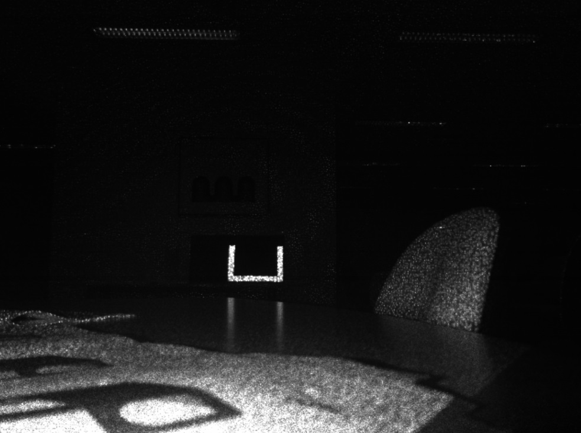

Kinect + OpenCV Vision Tracking
----

This is the C/C++ mixed source for the Kinect + OpenCV Vision Processing and Targetting system on our Coprocessor for the 2016 FRC Tournament "FIRST Stronghold".

## What does it do?
This set of code does a LOT of stuff, so let's try and break it down.
- Tracks High Goal reflective material using the Infrared Stream of the Kinect Camera
- Converts vision streams into Contours and Bounding Rectangles to be sent to the RoboRIO

## How it works
We're using the [libfreenect](https://github.com/OpenKinect/libfreenect) library to grab streams from the Kinect Camera connected to the Coprocessor. These streams
are then converted to OpenCV Mats. The Infrared (IR) Stream is the most important one for us, so we use OpenCV to find contours matching a specific area and solidity
that mimic the high goal retroreflective tape. Once these are found, bounding boxes are resolved and all the valid information is sent to the RoboRIO for further processing.

## Why the Kinect?
We're using the Kinect Camera purely for it's IR Streams. In initial testing, we were looking at depth for resolving the distance we are to the tower, however the Kinect v1 is
no where near accurate enough to make this worthwhile. So why the IR streams? Well, retroreflective tape doesn't just reflect visible light, but infrared light as well. This means
that to an IR camera, the high goals stick out like a sore thumb.  

Because the High Goals stick out very well, it means that we don't have to look for a Green Hue as if we had an LED ring around the camera. This means that people in green shirts, 
or the field floor, is not accidentally tracked. Now I know what you're thinking: 'What about robots that sit in front of you? Won't they be detected?'. Well, the answer is no. Because
our Robot is tall this year (i.e. not lowbar capable), and the Kinect is mounted at about 30 degrees to the horizontal, the only thing we're looking at is the High Goal. This makes vision
targetting very reliable, and means we can say with almost 100% certainty "yes, that is the high goal".

## What does the RoboRIO do?
The RoboRIO only looks at where the high goal is in the field of view of the camera. Instead of calculating a distance based on the area of the goal or aspect ratio and any bullshit like that,
we just use where the goals are relative to the bottom of the image frame. Because our camera is fixed, this means that we can have a table of "known-to-work" values that we can interpolate
with to get a launch velocity. Many teams think that they need to calculate distance to get an accurate shot, but in our case, that's just doing more work than is necessary. 

The RoboRIO also has an Alignment Strategy, where it will try to center the high goals in the center of the frame, in preparation for taking a shot. This is a pretty simple feedback loop, but may
take some time as the processing power of the Pi is not powerful enough for a 30fps stream from the Kinect. In our testing (on a single core), we've peaked at about 5fps, which is enough in most cases,
as all shots are taken from a stationary position. Theoretically this could be increased by multithreading, but our Coprocessor is also handling motion profile generation, so we don't want to hog CPU time.
