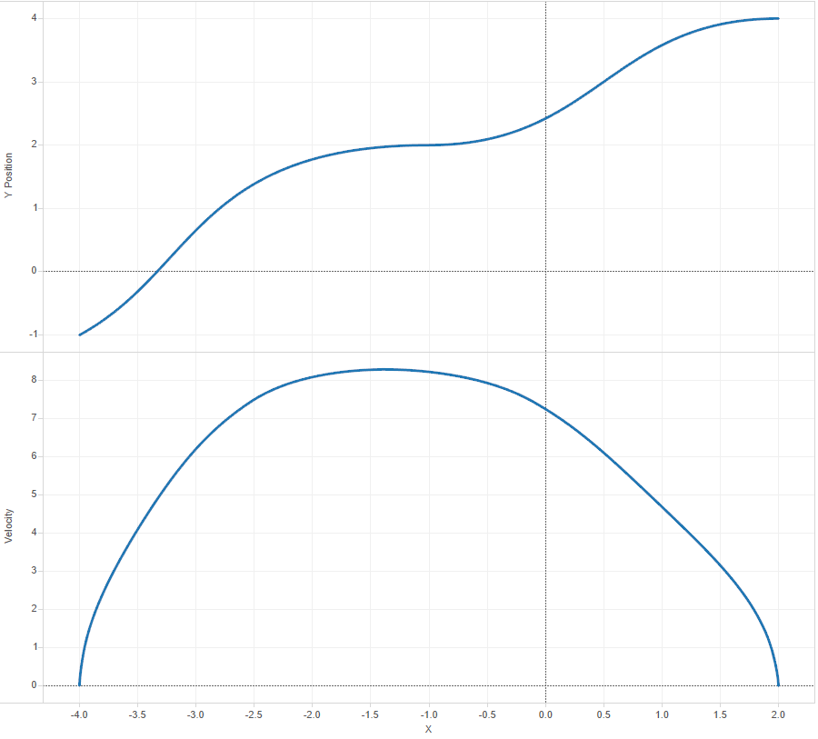

Trajectory Generation and Spline Fitting
----

This is the C source for the Trajectory Generation and Spline Fitting library used on our Coprocessor for the 2016 FRC Tournament "FIRST Stronghold".

## Rationale
We wrote this in C as opposed to the Java alternative for multiple reasons:
- **Offloading**. We didn't want to run this on the RoboRIO, as there were plans to generate a large number of trajectories in bulk, used
for autonomous plans. This was all to be done in realtime, so offloading seemed like the best option.
- **Speed**. Time is valuable, espectially with a 2:30 time limit. Every second counts, so we wrote this in C to make it run extremely quick
on the ARM Coprocessor.
- **Memory Allocation**. Instead of dedicating a JVM instance to the library, we can instead allocate memory as we need it. This has the advantage
of being more efficient and using less memory (especially when there are other processes running on the coprocessor), and also allows the program
to function on the CPU Cache more efficiently.

## What does it do?
Spline Fitting is a fancy way of saying "Generate a curve from point a to b". Trajectory Generation is a fancy way of saying "now generate the speeds
I need to go at from point a to b". Basically, the Spline Fitting plots a path, and the Trajectory Generation makes sure the Robot follows the path smoothly,
without jerking, and accurately. This Library has support for multiple waypoints (e.g. point a, b, c, ...), and will generate all the 'interim' points that
the robot should be at, and the speed it should be travelling at each of these points. In the Robot drive code (on the RoboRIO), we can compensate for this using
Feed-Forward (where am I supposed to be in the future) and Feed-Back (where am I supposed to be now), and correcting accordingly.

Below is a sample generation (X/Y Plot on the Top, X/Velocity Plot on the Bottom).
This was generated with waypoints `( -4, -1 @ 45 deg )`, `( -1, 2 @ 0 deg )` and `( 2, 4 @ 0 deg )`.



## Directory Structure
Everything beneath `src/library` contains the actual spline fitting and trajectory generation code.   
 
Everything beneath `src/impl` contains the code that runs the spline fitting and communicates to our main processor (the RoboRIO)

The Makefile contained in the Root Directory will make both the library and implementation into one executable.

## Using the Library
If you want to use the Library without the Implementation, these functions will show you how to use the library and it's functions.

### Includes
```c
#include "splinelib.h"
```

### Creating some Waypoints:

```c
int POINT_LENGTH = 3;

Waypoint points[POINT_LENGTH];

Waypoint p1 = { -4, -1, d2r(45) };      // Waypoint @ x=-4, y=-1, exit angle=45 degrees
Waypoint p2 = { -1, 2, 0 };             // Waypoint @ x=-1, y= 2, exit angle= 0 radians
Waypoint p3 = {  2, 4, 0 };             // Waypoint @ x= 2, y= 4, exit angle= 0 radians
points[0] = p1;
points[1] = p2;
points[2] = p3;
```

### Creating the Trajectory

```c
TrajectoryCandidate candidate;

// Prepare the Trajectory with a Cubic Hermite Fit, High Spline Samples (100000 iterations), 
// 0.01 time step, 15 max velocity, 10 max acceleration, 60 max jerk
trajectory_prepare_candidate(points, POINT_LENGTH, FIT_HERMITE_CUBIC, SPLINE_SAMPLES_HI, 0.01, 15.0, 10.0, 60.0, &candidate);

int length = candidate.length;

// Create the Segments array
Segment seg[length];
trajectory_generate(&candidate, &seg);
```

You can also use `FIT_HERMITE_QUINTIC` for a Quintic Hermite Spline fit.
`SPLINE_SAMPLES_HI` can be changed to whatever count of iterations you like, but there are also definitions for `SPLINE_SAMPLES_LO` and
`SPLINE_SAMPLES_FAST`. HI = 100 000, LO = 10 000, FAST = 1 000.

### Using the Segments

```c
int i;
for (i = 0; i < length; i++) {
    Segment s = seg[i];
    printf("Time Step: %f\n", s.dt);
    printf("Coords: (%f, %f)\n", s.x, s.y);
    printf("Position (Distance): %f\n", s.position);
    printf("Velocity: %f\n", s.velocity);
    printf("Acceleration: %f\n", s.acceleration);
    printf("Jerk (Acceleration per Second): %f\n", s.jerk);
    printf("Heading (radians): %f\n", s.heading);
}
```